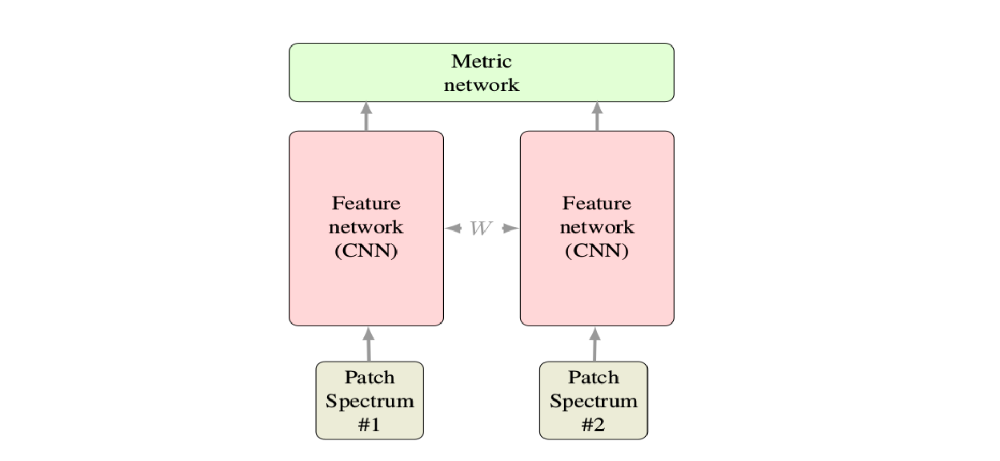

# 1. siamese_network孪生网络

【参考】https://www.cnblogs.com/king-lps/p/8342452.html

+ siamess网络架构图


+ 损失函数：


其中，m为容忍度， Dw为两张图片的欧氏距离：


+ 环境：
    torchversion: 0.2.1
    torch: 1.2.0

+ 数据
    数据采用的是AT&T人脸数据。共40个人，每个人有10张脸。
    数据链接： https://files.cnblogs.com/files/king-lps/att_faces.zip
    首先解压后发现文件夹下共40个文件夹，每个文件夹里有10张pgm图片。这里生成一个包含图片路径的train.txt文件共后续调用：

-------------
# 2. 猫狗识别

+ 代码来源：《深度学习框架：pytorch入门与实践》--作者：陈云


--------------
# 3. 简单手势分类器

+ 代码来源：https://www.jianshu.com/p/c4723a4409cf


-----------------
# 4. triplet-loss网络

+ 代码来源：https://github.com/andreasveit/triplet-network-pytorch


----------------
# 5. word2vec


-----------------
# 6. 图片风格迁移


# 4、pytorch环境搭建
+  mac下安装pytorch 
    + 安装pytorch
       ```shell
       sudo pip install http://download.pytorch.org/whl/torch-0.3.0.post4-cp27-none-macosx_10_6_x86_64.whl 
       sudo pip install torchvision 
       sudo pip install -U numpy #升级mac自带的numpy。如果不升级numpy，你的pytorh代码跑不动
       ```

    + 如果不能升级`numpy`，升级报下面的错误：
      ```shell
      module compiled against API version 0xa but this version of numpy is 0x9
      ```

      那是因为mac的System Integrity Protection的问题，解决的办法是关闭保护SIP。操作如下： 

      1. 重启电脑，电脑启动的时候按住command+R 

      2. 在看到苹果logo后会进入实用工具窗口，点左上角的实用工具里面的”终端”，输入 

      ```shell
      csrutil disable
      ```

    + 如果用`pip install XXX`命令安装XXX包报错，提示安装`six`出错，原因是`six`已经存在，那么使用下面的命令
      ```shell
      pip install XXX --upgrade --ignore-installed six
      ```

+ 参考：

    [【参考】mac安装pytorch及系统的numpy更新](https://blog.csdn.net/fengtanyu3470/article/details/79080207)

    [【参考】解决 mac安装或者更新第三方包安装不上的问题](https://blog.csdn.net/helloxiaozhe/article/details/78603183)


